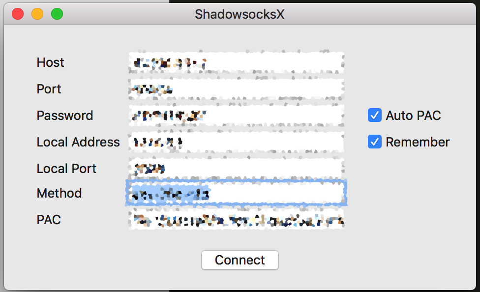

# ShadowsocksX-dummy
An extremely simplified version of ShadownsocksX-NG, only remains the minimal to start a shadowsocks server.

## Why

The original ShadowsocksX-NG is repo is too complicated for people to comprehend how it works. Here is a bare minimal version of the macOS version
of ShawdowsockX client.

Currently support *auto proxy* with pac, *global proxy* or *no proxy*.

## How to use?

There are still a couple questions regarding how to specify the method & pac, here are two examples:

Method field should be in this format: aes-128-cfb

PAC field should be like this: 

If local pac files -> file:///home/user/abc/pac.pac 
If remote pac files -> http://pac.uku.im/pac.pac.

The expected format of the input pac file should be similar to the one at http://pac.uku.im/pac.pac. If you don't understand how PAC works or what is PAC, visit: https://en.wikipedia.org/wiki/Proxy_auto-config

### Screenshot

## LICENSE

The project is released under the terms of the GPLv3.
